# RenderGPU
Segona pràctica de GiVD 2020-21

**Abstract**

Para esta prácticamos hemos comenzado adaptando el código de la práctica anterior de Raytracing. Hemos implementado la gestión de materiales, luces, sombras y texturas a diversos tipos de objetos. De este modo hemos comparado los diferentes materiales y sombras para un mismo objeto, visualizado distintas texturas en distintos objetos y aplicado texturas en una shader concreta con una iluminación específica.

**Features**

- Fase 1
    - Adaptació a la lectura de fitxers de dades
        - [x] Objectes  |  (Mario)
        - [x] Escenes virtuals  |  (Mario)
        - [x] Escenes de dades Reals | (Mario)
    -  [x] Material | Joan
    - Light
        - [x] Puntual | (Ignacio)
        - [-] Direccional | (Ignacio)
        - [-] Spotlight | (Ignacio)
        - [x] Ambient Global | (Ignacio)
    - Shading
        - [x] Phong  |  (Estíbaliz)
        - [x] Gouraud  |  (Estíbaliz)
    - Textures
        - [x] Textura com material en un objecte | (Joan)
        - [x] Textura al pla base | (Mario)

- Fase 2 (OPT)
    - [x] Toon-shading i èmfasi de siluetes  |  (Estíbaliz)
    - [x] Mapping indirecte de textures | (Joan)
    - [ ] Animacions amb dades temporals
    - [ ] Normal mapping
    - [ ] Entorn amb textures
    - [ ] Reflexions
    - [ ] Transparencias via objectes.
    - [ ] Transparencias via environmental mapping.

**Extensions**

No hemos añadido ninguna funcionalidad extra fuera del guión de la práctica

## Memòria
#### 1) Adaptació a la lectura de fitxers de dades
Primerament, hem adaptat totes les classes de la pràctica anterior de tal manera que encaixessin amb les noves classes (`/library`). D'aquesta manera hem fet també el aplicaTG a `Object.c`. A continuació hem creat la classe `FittedPlane` que hereda d'Object i implementa la creació d'un pla acotat.

Pel que fa a la càrrega de dades virtuals. Dins la classe `Builder` tenir el mètode que les carrega. Ara mateix esta configurat per a que agafi un fitxer de configuració hardcodejat. Per a que no sigui massa pesat executar les escenes. De totes maneres es podría fer també amb un dialog.

tipus d'objectes virtuals:
1. brobject
2. brobject traslladat

Podem trobar un exemple de 1. a `basic_spheres.txt` i de 2. a  basic_spheres_translate.txt`

**important!** quan es fa un `brobject` traslladat cal que el ".obj" estigui centrat a (0,0,0) per a que es faci correctament el trasllat.

Pel que fa a dades reals, el funcionament segueix el de la practica 1 en els fitxers de configuració. Es pot trobar algun exemple a `basic_data_test.txt`. A les screenshots es poden veure dos exemples amb dades reals.

### Comentari addicional:
S'han adaptat els fitxer d'entrada d'escenes virtual per a poder posar els materials:
+ `brobject ,route ,position ,difuse color`
+ `brobject ,route ,position ,difuse color ,especular color ,ambient color ,shineness`

Es pot trobar un exemple a `basic_spheres_translated_diffuse.txt`

##
#### 2) Material

En aquesta segona secció sen’s demana implementar la classe `Material` per a poder fer  el pas de les seves diverses components 
a la GPU. Per a fer això les modificacions que hem fet ha sigut afegir a la classe `Object` un atribut material, el qual es crearà junt amb els altres atributs d’objecte.

En el inici del  mètode draw de `Object` hem afegit la crida al mètode toGPU que passarà els seus valors a la GPU.
Aquesta comunicació la fem amb structs tant a la CPU com a la GPU.

Finalment, en el fitxer de vertexshader, agafem els valors de CPU. Per a fer això tenim un uniform de tipus struct amb les diverses components. 
Per comprobar que aquestes dades han sigut agafades correctament hem diverses execucions on cada cop el color serà igual a una component del material diferent.
La component shineness és la única que no és un vector, per tant per a setejar que el color sigui igual a ella hem creat un vec4 que cada component és igual al valor de shineness.

Els valors de cada component han sigut setejats en el constructor de la classe Material.
##
#### 4) Shading
Primeramente, nos hemos enfocado en la implementación de las normales en `Object.cpp` mediante la representación de mallas poligonales explícita. Por otro lado, en `GLWidget.cpp`creamos un array denominado `type_shaders`que se encargará de gestionar los distintos tipos de shaders que utilizamos de modo que cada índice del array corresponde a un shader: 0 para el shader en el que plicamos las normales, 1 para Gouraud, 2 para Phong, 3 para Toon, 4 para Phong con textura y 5 para Phong con textura indirecta. Esta correspondencia y su adecuada inicialización en la GPU la hacemos en el método `initShadersGPU` de esta misma clase. 

Inicialmente cuando ejecutamos nuestro programa y abrimos una figura cualquiera por defecto tenemos activada la shader 0 (La visualización de normales), esta acción la determinamos en el método `initializeGL` asignando a la variable program de nuestra GPU la shader 0 y montando la misma. Para cada una de nuestras shaders tenemos su correspondiente método de activación que linkea y monta esta shader y a continuación hace una llamada a `updateShader` para actualizar la GPU.

##### Gouraud
Como esta técnica se encarga de calcular las normales a cada vértice su implementación la llevamos a cabo en el `vertex shader` y en el `fragment shader` nos limitamos a recibir el color obtenido en el `vertex shader` para a continuación devolverlo, pues queremos interpolar el color a nivel de píxel. Para ello en nuestro `vertex shader`calcularemos para cada posible luz la dirección de ésta junto con su correspondiente atenuación y mediante el algoritmo de *Bling Phong* obtendremos el color resultante (según esta luz y los materiales usados) que almacenaremos en la variable local `aux_color` teniendo en cuenta su atenuación.

##### Phong
Su implementación es análoga a la técnica anterior excepto porque en esta ocasión el código descrito en el apartado anterior lo usaremos en el `fragment shader`ya que ahora interpolaremos las normales a nivel de píxel en lugar de calcularlas para cada vértice.

##### Toon (OPCIONAL)
El método utilizado para esta técnica ha sido la implementación directa en el `fragment shader`, es decir calculamos la intensidad por pixel. Para ello la implementación del `vertex shader` es bastante básica pues solo será necesario escribir la normal y la posición como *outputs* que pasarle al fragment. En el `fragment shader` declaramos una variable local `intensity`que es la que nos ayuda a escoger los *tons* almacenando el coseno del ángulo entre la normal y la dirección de la luz. Para ello aplicaremos la siguiente fórmula , en la que teniendo en cuenta que el módulo de la normal y la dirección de la luz serán 1 solo es necesario que normalizemos la luz `L` y la normal `N` y calculemos el producto escalar entre estos dos vectores.

Seguidamente, elegimos los *tons* de manera que asignamos los colores más claros cuando el coseno es mayor de 0.95, es decir cuando la normal y la dirección de la luz están próximas, y los colores más oscurs cuando el coseno es menor de 0.25, normal y dirección de la luz más lejanas entre sí.

Cabe mencionar que todo este proceso lo repetimos para cada una de las luces que podamos tener por ello usamos un bucle recorriendo nuestro arreglo de luces como en los shaders anteriores. 
##
#### 5) Textures  

Per a poder passar les textures a la gpu hem agat d’afegir al buffer espai per a el vector de vertexstexture.
Com que inicialment només podem aplicar textures als objectes que el seu fitxer obj conté les coordenades de vt hem afegit un if comprobant que el vector on s’ha afegit aquestes coordenades no està buit, així els objectes que no tinguin textures no sel’s intentara aplicar la textura i evitarem errors.

##### Mapeig indirecte (OPCIONAL)

En aquest apartat hem fet l’opcional de textures indirectes. Per a fer-ho, en els shaders de phong_texture_indirect hem modificat el codi per a que enlloc de passar desde el vshader a fshader les coordenades de textures que s’han enviat desde cpu, fem el càlcul de u,v.

A més tal i com hem explicat anteriorment els objectes que no tenen vt no sel’s pot aplicar textures, el que hem fet és que en la classe objecte, en el mètode make, al assignar els vertexs de la textura, en cas que no s’hagin llegit del fitxers els calcularem manualment amb la fòrmula de mapeig indirecte.
Així les spheres i alguns altres objectes també podran tenir textures.
En aquesta part hem tingut alguns problemes a l'hora de calcular les coordenades e textura amb el mètode de la capsa tal i com s'ens demana a l'enunciat. A classe de teoria vam veure que hi ha diferents mètodes per a calcular aquestes coordenades així que hem acabat optant per el mètode que usa les normals dels vèrtexs. En el projecte s'usa el de les normals ja que és el que funciona però en el mètode make de la classe `objecte.cpp` hem deixat comentada la línia que faria que s'uses el mètode de la capsa, així si es vol provar quina imatge observariem es pot fer. Tot i això en l'apartat de screenshots deixarem una on s'observi l'output que obtenim.

Per a poder provar els shaders de mapping inderecte hem afegit al menú de textures una nova opció, anomenada PhongTex Indirecte, habilitant aquesta opció podrem provar les textures indirectes.

Si volem provar el mapeig indirecte en objectes sense vèrtexs de textura el que hem de fer és escollir un objecte sense, com ara el sphere o el monkey i seleccionar PhongTex. Ja que com que no tenen vertexs de textura els hi assignarem de la manera indirecta.

##

## Screenshots
### 1) Adaptació a la lectura de fitxers de dades
`virtual_data.txt` i `configMapping.txt`

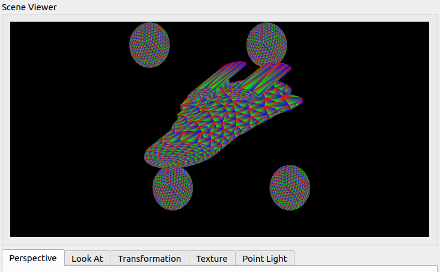

`basic_data_test.txt` i `configMappingData.txt`
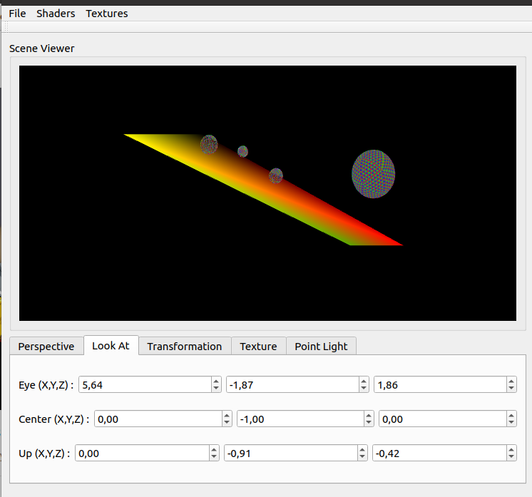

`basic_data_test.txt` amb les esferes juntes al pla y=0
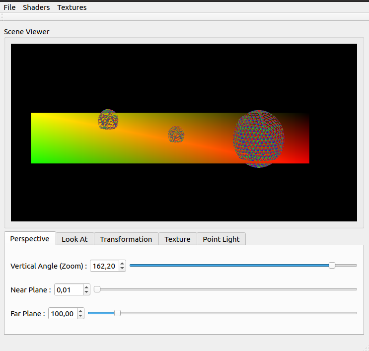

### 2) Material

Els valors de les diverses components han sigut setejades per a què s’ens mostrin les circumferències de color: vermell, verde, blau i blanc segons la component que usem.
En totes les execucions els valors són els mateixos però mostrem una component diferent. Per a deixar clar a quina correspon escribim junt a la imatge la component que és i quin valor té.

Component ambient = (1.0,0.0,0.0)

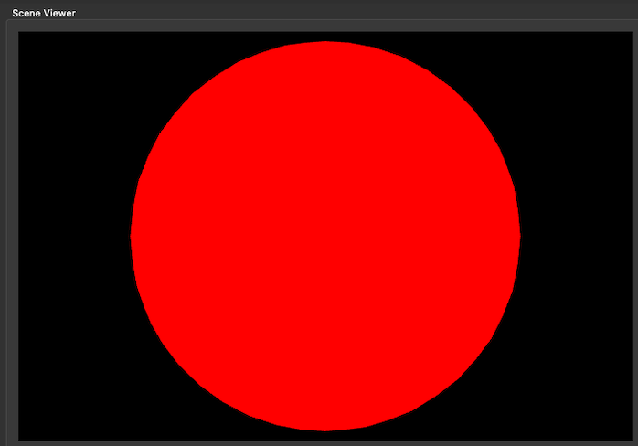

Component difusa = (0.0,1.0,0.0)

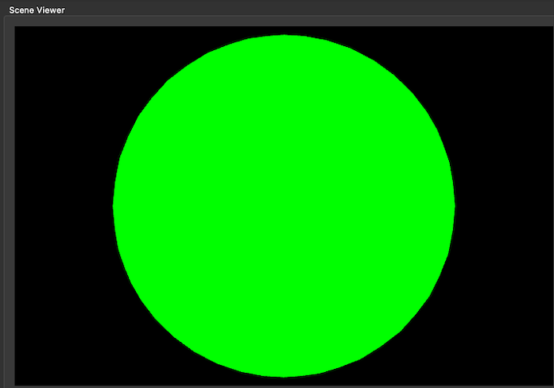

Component especular = (0.0,0.0,1.0)

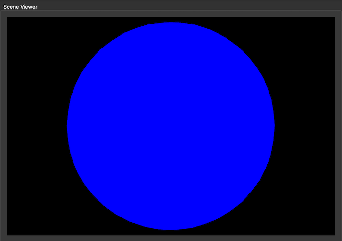

Shineness = 1.0

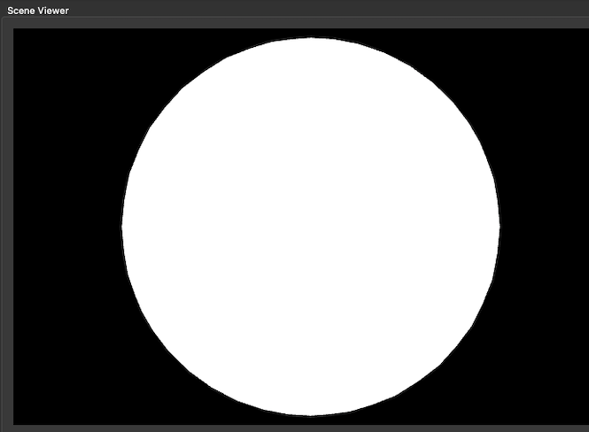

### 3) Light

En esta sección hemos implementado la clase luces. Utilizamos dos constructores, uno en el que podemos cambiar todos los parámetros y otro en el que tenemos todos definidos menos el tipo de la luz. Tenemos únicamente dos constructores porque, aunque hay tres tipos de luces, hemos optado por definir todos los atributos para todos los tipos de luz, para mayor facilidad al utilizar los shaders, y utilizar únicamente los atributos que necesitáramos para cada luz.

Tras implementar todos los setters y los getters hemos programado el método que manda las luces(sus atributos) a la GPU, utilizando un struct para la CPU y otro para la GPU, para cada luz.

En `Scene.cpp` implementamos también el método que envía las luces a la GPU, que aprovecha el método mencionado anteriormente de la clase `Light`. También tenemos el método que manda la luz ambiente a la GPU. En este caso utilizamos una variable uniform y no un struct como anteriormente.

En los "shaders" iteramos sobre todas las luces de `Scene` y comprobamos en cada iteración qué tipo de luz es. La luz direccional se caracteriza por no tener un origen, únicamente una dirección, por lo que no reflejamos una posición ni una atenuación; mientras que la luz "Spotlight" se caracteriza por formar un cono de luz que iluminará los objetos que se encuentren en su interior. Estas dos últimas luces, aunque creemos que tienen una implementación correcta, no hemos conseguido que funcionen por diversos problemas.

La siguiente imagen muestra dos luces puntuales aplicadas a dos esferas:

Vemos la aplicación de tres luces puntuales a una esfera:

### 4) Shading
La següent imatge és la representació de les normales d'una esfera (`sphere0.obj`).

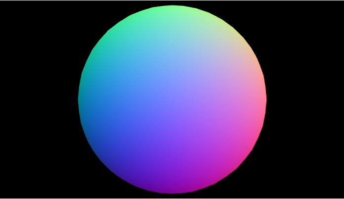

En totes les imatges d'ombra que es mostren la configuració que s'ha usat és la següent:
- Material: `ambient = (0.2,0.2,0.2)`, `diffuse = (0.8,0.5,0.5)`, `especular = (1.0,1.0,1.0)`, `shineness = 20`.
- Light: `iD_ = (0.8,0.8,0.8)`, `iS_ = (1,1,1)`, `iA_ = (0.2,0.2,0.2)`, `position_ = (10,10,20,0)`, `coeficients_ = (0,0,1)`
- Scene: `lightAmbientGlobal = (0.3, 0.3, 0.3)`

A continuació podem observar una esfera (`sphere0.obj`)a la que se li ha aplicat el sombrejat de Gouraud.

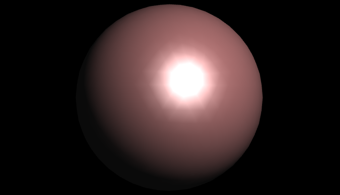

En aquesta imatge es pot apreciar l'ús del sombrejat de Phong en una esfera (`sphere0.obj`). Tot i que les diferències son poc perceptibles es pot observar que per a Phong la llum que visualitzem es troba més suavitzada, aquest resultat és l'esperat ja que al calcular les normals per a cada píxel, enlloc de per a cada vèrtex de la imatge, el resultat serà més 'natural' enlloc de tenir una apariencia més pixelada.

Per poder comparar les imatges obtingudes amb aquestes dues tècniques la millor opció es posar la component especular de la llum a (1,1,1).

Finalment, podem visualitzar com l'ombrejat de Toon en una  esfera (`sphere0.obj`) proporciona un efecte més pla del sombrejat de la esfera, fent-la semblar menys realista.

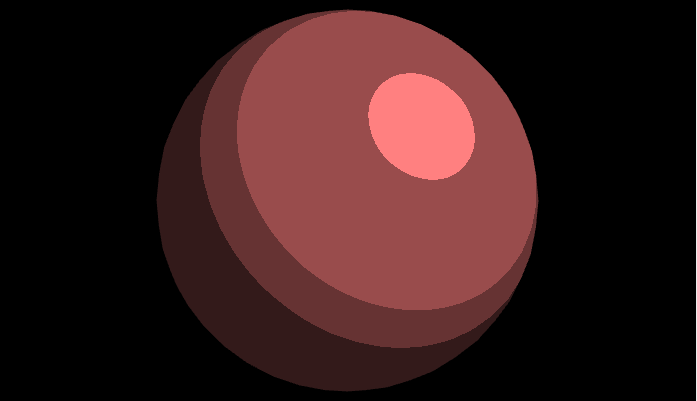

Destacar la consult de  [Simulació Gouraud/Phong](https://rabbid76.github.io/graphics-snippets/html/stackoverflow/gouraud_phong.html) per a visualitzar diverses figures amb les diferentes tècniques de shaders per a tal de poder comparar les imatges obtingudes.

### 5) Texture

La següent imatge ens mostra l'objecte `MonkeyTex.obj` amb la textura `MonkeyTex.png`, la configuració ha sigut la mateixa que s'ha utilitzat anteriorment.

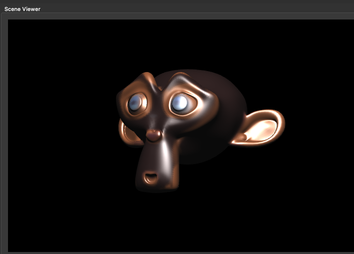

La següent imatge ens mostra l'objecte `capsule.obj` amb la `textura 2k_earth_daymap.jpg`, la configuració ha sigut la mateixa que s'ha utilitzat anteriorment.

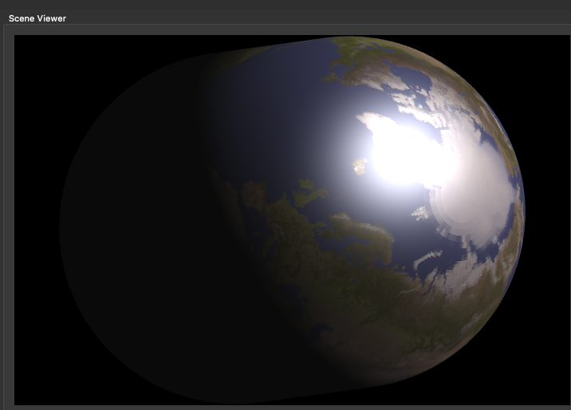

La següent imatge són les mateixes dades que l'anterior però aquest cop fent servir el mapeig indirecte de textures.

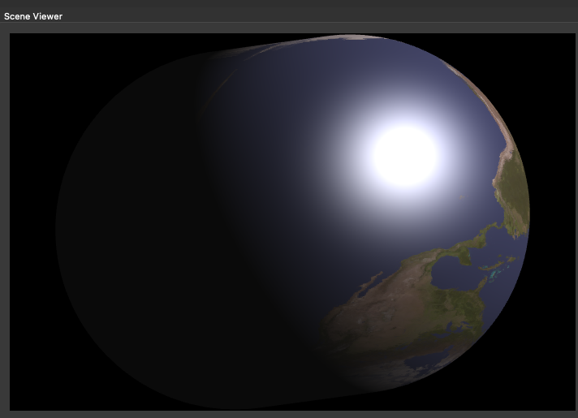

La següent imatge es correspon a l'objecte `sphere0.obj` amb els paràmetres usats en les altres screenshots i amb mapeig indirecte de textures a partir de la normal dels vèrtexs.

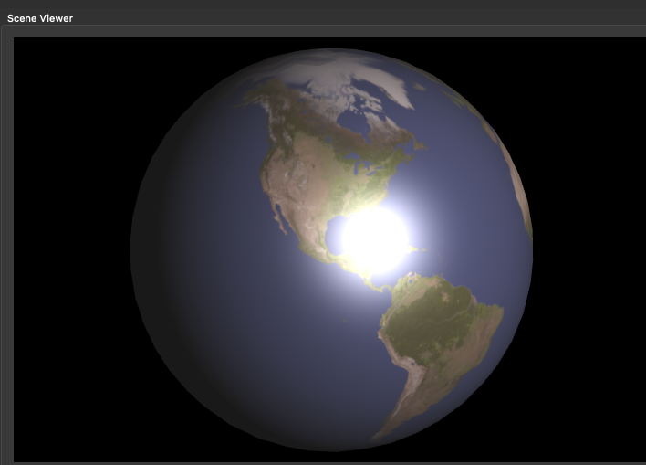

La següent imatge es correspon a l'objecte `sphere0.obj` amb els mateixos paràmetres pero aquest cop usant el mètode del centre de la capsa mínima.

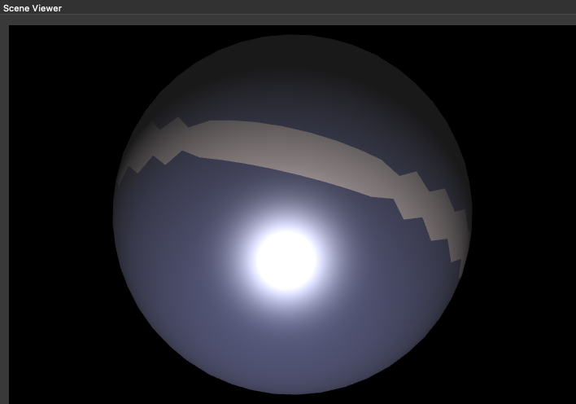

Dades reals amb un pla amb textura. (Notem que hi ha força Z-fighting)

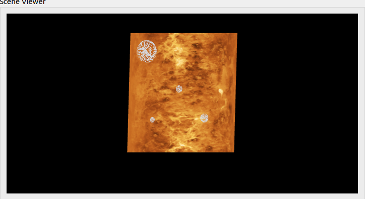

*(NOTA: Per a cada pas de l'enunciat (del 1 al 6), incloure captures de pantalla de les proves que heu fet per a demostrar la funcionalitat de la vostra pràctica amb explicacions de la seva configuració i com les heu aconseguides)*

*(NOTA2: Breu explicació, si cal, de com replicar els vostres resultats)*

**Additional Information**

*(NOTA: Hores de dedicació i problemes que heu tingut fent la pràctica)*
