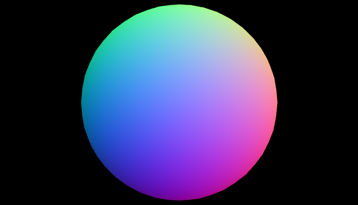

# RenderGPU
Segona pràctica de GiVD 2020-21

**Abstract**

Aquesta pràctica esta adaptada a partir del codi de la pràctica anterior de Raytracing. S'ha implementat la gestió de materials, llums, ombres i textures a varis tipus d'objectes. D'aquesta manera s'han comparat diversos material i ombre per a un mateix objecte i aplcat textures en un shader concret amb una iluminació específica.

**Features**

- Fase 1
    - Adaptació a la lectura de fitxers de dades
        - [x] Objectes  |  (Mario)
        - [x] Escenes virtuals  |  (Mario)
        - [x] Escenes de dades Reals | (Mario)
    -  [x] Material | Joan
    - Light
        - [x] Puntual | (Ignacio)
        - [x] Direccional | (Ignacio)
        - [x] Spotlight | (Ignacio)
        - [x] Ambient Global | (Ignacio)
    - Shading
        - [x] Phong  |  (Estíbaliz)
        - [x] Gouraud  |  (Estíbaliz)
    - Textures
        - [x] Textura com material en un objecte | (Joan)
        - [x] Textura al pla base | (Mario)

- Fase 2 (OPT)
    - [x] Toon-shading i èmfasi de siluetes  |  (Estíbaliz)
    - [x] Mapping indirecte de textures | (Joan)
    - [ ] Animacions amb dades temporals
    - [ ] Normal mapping
    - [ ] Entorn amb textures
    - [ ] Reflexions
    - [ ] Transparencias via objectes.
    - [ ] Transparencias via environmental mapping.

**Extensions**
S'han implementat un parell de extensions corresponents a la fase 2, veure índex.

## Memòria
### 1) Adaptació a la lectura de fitxers de dades
Primerament, hem adaptat totes les classes de la pràctica anterior de tal manera que encaixessin amb les noves classes (`/library`). D'aquesta manera hem fet també el aplicaTG a `Object.c`. A continuació hem creat la classe `FittedPlane` que hereda d'Object i implementa la creació d'un pla acotat.

Pel que fa a la càrrega de dades virtuals. Dins la classe `Builder` tenir el mètode que les carrega. Ara mateix esta configurat per a que agafi un fitxer de configuració hardcodejat. Per a que no sigui massa pesat executar les escenes. De totes maneres es podría fer també amb un dialog.

tipus d'objectes virtuals:
1. brobject
2. brobject traslladat

Podem trobar un exemple de 1. a `basic_spheres.txt` i de 2. a  basic_spheres_translate.txt`

**important!** quan es fa un `brobject` traslladat cal que el ".obj" estigui centrat a (0,0,0) per a que es faci correctament el trasllat.

Pel que fa a dades reals, el funcionament segueix el de la practica 1 en els fitxers de configuració. Es pot trobar algun exemple a `basic_data_test.txt`. A les screenshots es poden veure dos exemples amb dades reals.

#### Comentari addicional:
S'han adaptat els fitxer d'entrada d'escenes virtual per a poder posar els materials:
+ `brobject ,route ,position ,difuse color`
+ `brobject ,route ,position ,difuse color ,especular color ,ambient color ,shineness`

Es pot trobar un exemple a `basic_spheres_translated_diffuse.txt`

##
### 2) Material

En aquesta segona secció sen’s demana implementar la classe `Material` per a poder fer  el pas de les seves diverses components 
a la GPU. Per a fer això les modificacions que hem fet ha sigut afegir a la classe `Object` un atribut material, el qual es crearà junt amb els altres atributs d’objecte.

En el inici del  mètode draw de `Object` hem afegit la crida al mètode toGPU que passarà els seus valors a la GPU.
Aquesta comunicació la fem amb structs tant a la CPU com a la GPU.

Finalment, en el fitxer de vertexshader, agafem els valors de CPU. Per a fer això tenim un uniform de tipus struct amb les diverses components. 
Per comprobar que aquestes dades han sigut agafades correctament hem diverses execucions on cada cop el color serà igual a una component del material diferent.
La component shineness és la única que no és un vector, per tant per a setejar que el color sigui igual a ella hem creat un vec4 que cada component és igual al valor de shineness.

Els valors de cada component han sigut setejats en el constructor de la classe Material.
##

### 3) Light

En aquest secció hem implementat la classe `light`. Utilitzem dos constructors, un al qual podem canviar tots els parametres i un altre en el qual tenim tots definits menys el de tipus llum. Disposem unicament de os constructors ja que, encara que hi hagin tres tipus de llums, hem optat per definir tots els atributs per a tots els tipus de llums. Aixi tenim una major comoditat a l'hora d'utilitzar els shaders i utilitzar unicament els atributs que necesitàvem per a cada llum.

Després d'implementar tots els setters i getters hem programat el mètode que envia les llums (els seus atributs) cap a la GPU, tot utilitzant un struct per a la CPU i un altre per a la CPU, per cada llum.

En `Scene.cpp` implementem també el mètode que envia les llums a la GPU, el qual aprofita el mètode esmentat previament de la classe `Light`. De la mateixa manera tenim el mètode que envia la llum ambient a la GPU. en aquest cas utilitzem una variable uniform i no un struct com abans.

En els "shaders" iterem sobre totes les llums de `Scene` i comprovem a cada iteracció quin tipus de llum és. La llum direccional es caracteritza per no tenir un origen, unicament una direcció. Per tant no hi reflexem ni una posició ni una atenuació; D'altra banda la llum "Spotlight" es caracteritza per formar un con de llum que iluminarà unicament els objectes que es trobin a l'interior d'aquest. A estas dos les he incluido un "opcional", earthlight, que permite ver un efecto como el de la Luna al alinearse con la Tierra. Es un efecto que he encontrado probando el Spotlight y me ha parecido curioso dejarlo.

### 4) Shading

Primerament, ens hem enfocat en l'implementació de les normals a `Object.cpp` mitjantçant la representació de malles poligonals explicita. D'altra banda, a `GLWidget.cpp` creem un array anomenat `type_shaders` que s'encarregarà de gestionar els diferents tipus de shaders que utilitzem de manera que cada index de l'array es correspongui a un shader: 0 per al shader en que apliquem les normales, 1 per a Goraud, 2 per a Phong i 3 per a Toon, 4 per a Phong amb textura i 5 per Phong amb textura indirecta. Aquesta correspondència i la seva adequada inicialització a la GPU la fem al mètode `initShadersGPU` d'aquesta mateixa classe.

Inicialment quan executem el programa i obrim una figura qualsevol per defecte, tenim activada la shader 0 (visualització de normals), aquesta acció la determinem en el mètode `initializeGL` asignant a la variable program de la nostra GPU la shader 0 i muntant la mateixa. Per a cadascun dels nostres shaders tenim el seu corresponent mètode d'activació que linkeja i munta aquest shader i a continuació fa una crida a `updateShader` per a actualitzar la GPU.

#### Gouraud
Com aquest técnica s'encarrega de calcular les normals a cada vertex. la seva implementació la duem a terme al `vertex shader` i en el `fragment shader` ens limitem a rebre el color entrat per a continuació retornarlo, al cap i a la fi únicament interpolem el color a nivell de píxel. Per això al nostre `vertex shader` calculem per a cada possible llum la direcció d'aquesta junt amb la seva corresponent atenuació i mitjantçant l'algorisme de *Bling Phong* obtenim el color resultant (segons la llum i els material utilitzats) que guardem a la variable local `aux_color` tenint en compte la seva atenuació.

#### Phong
La seva implementació és semblant a la técnica anterior exceptuant peruqe en aquesta ocasió el codi descrit a l'apartat anterior ho usarem al `fragment shader` ja que ara interpolarem les normals a nivell de píxels en comptes de calcular-les per a cada vèrtex.

#### Toon (OPCIONAL)
El mètode utilitzat per aquesta tècnica ha estat la implementació directa al `fragment shader`, es dir calculem la intensitat per píxel. Per aixo la implementació del `vertex shader` es bastant básica, doncs únicament sera necessari escriure la normal i la posició com *outputs* que pasarli al fragment. En el `fragment shader` declarem una variable local `intensity` que és la que ens ajuda a escollir els *tons* enmagatzemant el cosinus de l'angle entre la normal i la direcció de la llum. Per això apliquem la següent fórmula:  , en la que tenint en compte que le módulo de la normal i la direcció de la llum seran un sol es necesari que normalitzem la llum `L` i la normal `N` i calculem el producte escalar entre aquests dos vectors.

Seguidament, escollim els *tons* de manera que asignem els colors més clars quan el cosinus sigui major que 0.95. Es a dir, quan la normal i la direcció de la llum es trobin proximes i els colors més obscurs quan el cosinus és menor que 0.25. (El contrari fenòmen).

Cal mencionar que tot aquest procés el repetim per a cada una de les llums que poguem tenir. Per això utilitzem un bucle recorrent el nostre array de llums al igual que en els shaders anteriors.

##
#### 5) Textures  

Per a poder passar les textures a la gpu hem  d’afegir al buffer espai per a el vector de "vertexstexture".
Com que inicialment només podem aplicar textures als objectes que el seu fitxer obj conté les coordenades de vt hem afegit un if comprobant que el vector on s’ha afegit aquestes coordenades no està buit, així els objectes que no tinguin textures no sel’s intentara aplicar la textura i evitarem errors.

#### Mapeig indirecte (OPCIONAL)

En aquest apartat hem fet l’opcional de textures indirectes. Per a fer-ho, en els shaders de phong_texture_indirect hem modificat el codi per a que enlloc de passar desde el vshader a fshader les coordenades de textures que s’han enviat desde cpu, fem el càlcul de u,v.

A més tal i com hem explicat anteriorment els objectes que no tenen vt no sel’s pot aplicar textures, el que hem fet és que en la classe objecte, en el mètode make, al assignar els vertexs de la textura, en cas que no s’hagin llegit del fitxers els calcularem manualment amb la fòrmula de mapeig indirecte.
Així les spheres i alguns altres objectes també podran tenir textures.
En aquesta part hem tingut alguns problemes a l'hora de calcular les coordenades e textura amb el mètode de la capsa tal i com s'ens demana a l'enunciat. A classe de teoria vam veure que hi ha diferents mètodes per a calcular aquestes coordenades així que hem acabat optant per el mètode que usa les normals dels vèrtexs. En el projecte s'usa el de les normals ja que és el que funciona però en el mètode make de la classe `objecte.cpp` hem deixat comentada la línia que faria que s'uses el mètode de la capsa, així si es vol provar quina imatge observariem es pot fer. Tot i això en l'apartat de screenshots deixarem una on s'observi l'output que obtenim.

Per a poder provar els shaders de mapping inderecte hem afegit al menú de textures una nova opció, anomenada PhongTex Indirecte, habilitant aquesta opció podrem provar les textures indirectes.

Si volem provar el mapeig indirecte en objectes sense vèrtexs de textura el que hem de fer és escollir un objecte sense, com ara el sphere o el monkey i seleccionar PhongTex. Ja que com que no tenen vertexs de textura els hi assignarem de la manera indirecta.

##

## Screenshots
### 1) Adaptació a la lectura de fitxers de dades
`virtual_data.txt` i `configMapping.txt`

`basic_data_test.txt` i `configMappingData.txt`

`basic_data_test.txt` amb les esferes juntes al pla y=0

### 2) Material

Els valors de les diverses components han sigut setejades per a què s’ens mostrin les circumferències de color: vermell, verde, blau i blanc segons la component que usem.
En totes les execucions els valors són els mateixos però mostrem una component diferent. Per a deixar clar a quina correspon escribim junt a la imatge la component que és i quin valor té.

Component ambient = (1.0,0.0,0.0)

Component difusa = (0.0,1.0,0.0)

Component especular = (0.0,0.0,1.0)

Shineness = 1.0

### 3) Light

La següent imatge mostra dos llums puntuals aplicades a dues esferes:

Vemos la aplicación de tres luces puntuales a una esfera:

### 4) Shading
La següent imatge és la representació de les normales d'una esfera (`sphere0.obj`).

En totes les imatges d'ombra que es mostren la configuració que s'ha usat és la següent:
- Material: `ambient = (0.2,0.2,0.2)`, `diffuse = (0.8,0.5,0.5)`, `especular = (1.0,1.0,1.0)`, `shineness = 20`.
- Light: `iD_ = (0.8,0.8,0.8)`, `iS_ = (1,1,1)`, `iA_ = (0.2,0.2,0.2)`, `position_ = (10,10,20,0)`, `coeficients_ = (0,0,1)`
- Scene: `lightAmbientGlobal = (0.3, 0.3, 0.3)`

A continuació podem observar una esfera (`sphere0.obj`)a la que se li ha aplicat el sombrejat de Gouraud.

En aquesta imatge es pot apreciar l'ús del sombrejat de Phong en una esfera (`sphere0.obj`). Tot i que les diferències son poc perceptibles es pot observar que per a Phong la llum que visualitzem es troba més suavitzada, aquest resultat és l'esperat ja que al calcular les normals per a cada píxel, enlloc de per a cada vèrtex de la imatge, el resultat serà més 'natural' enlloc de tenir una apariencia més pixelada.

Per poder comparar les imatges obtingudes amb aquestes dues tècniques la millor opció es posar la component especular de la llum a (1,1,1).

Finalment, podem visualitzar com l'ombrejat de Toon en una  esfera (`sphere0.obj`) proporciona un efecte més pla del sombrejat de la esfera, fent-la semblar menys realista.

Destacar la consult de  [Simulació Gouraud/Phong](https://rabbid76.github.io/graphics-snippets/html/stackoverflow/gouraud_phong.html) per a visualitzar diverses figures amb les diferentes tècniques de shaders per a tal de poder comparar les imatges obtingudes.

### 5) Texture

La següent imatge ens mostra l'objecte `MonkeyTex.obj` amb la textura `MonkeyTex.png`, la configuració ha sigut la mateixa que s'ha utilitzat anteriorment.

La següent imatge ens mostra l'objecte `capsule.obj` amb la `textura 2k_earth_daymap.jpg`, la configuració ha sigut la mateixa que s'ha utilitzat anteriorment.

La següent imatge són les mateixes dades que l'anterior però aquest cop fent servir el mapeig indirecte de textures.

La següent imatge es correspon a l'objecte `sphere0.obj` amb els paràmetres usats en les altres screenshots i amb mapeig indirecte de textures a partir de la normal dels vèrtexs.

La següent imatge es correspon a l'objecte `sphere0.obj` amb els mateixos paràmetres pero aquest cop usant el mètode del centre de la capsa mínima.

Dades reals amb un pla amb textura. (Notem que hi ha força Z-fighting)

**Additional Information**

*(NOTA: Hores de dedicació i problemes que heu tingut fent la pràctica)*
